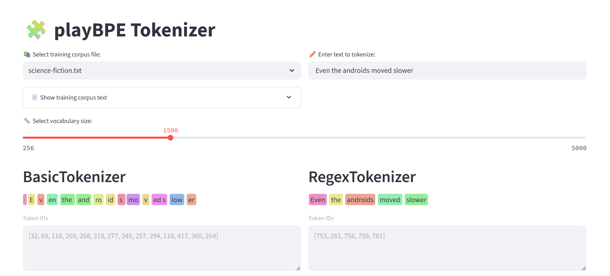

# playBPE
A playground to understand BPE. 

Tokenizers are based on Andrej Karpathy - Let's build the GPT Tokenizer https://www.youtube.com/watch?v=zduSFxRajkE&t=350s



# Set up the environment

1. Create virtual environment: ```python -m venv venv```

2. Activate virtual environment: ```source venv/bin/activate```

3. Install python dependencies: ```pip install -r requirements.txt```

# Tokenizer Tester (Python Script)

Run [tokenizer_tester.py](tokenizer_tester.py)

```python tokenizer_tester.py```


# Tokenizer Visualizer (Streamlit App)

Run [tokenizer_viewer.py](tokenizer_viewer.py) 

```streamlit run tokenizer_viewer.py```


Go to http://localhost:8501 in your browser.

